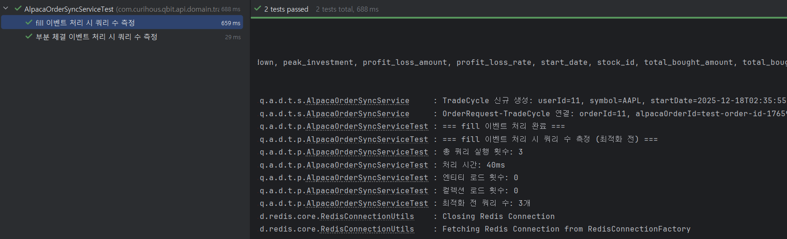

# N+1 쿼리 최적화: Trade Update 이벤트 처리 성능 개선

> 이 글은 큐빗(QBIT) 프로젝트에서 Trade Update 이벤트 처리 시 발생한 N+1 쿼리 문제를 발견하고 최적화한 과정을 공유한다.

## 1. 문제 발견

### 1-1. N+1 쿼리 문제란?

**N+1 쿼리 문제**는 ORM을 사용할 때 흔히 발생하는 성능 문제로, 하나의 쿼리로 부모 엔티티를 조회한 후, 각 부모 엔티티에 대해 N개의 추가 쿼리를 실행하여 연관된 자식 엔티티를 조회하는 현상을 말한다.

예를 들어, 100개의 주문을 조회한 후 각 주문의 사용자 정보를 조회하려고 하면:
- 첫 번째 쿼리: 주문 100개 조회 (1개)
- 각 주문마다 사용자 조회 (100개)
- **총 101개의 쿼리 실행**

이러한 문제는 데이터베이스 부하를 증가시키고, 응답 시간을 지연시켜 전체 시스템 성능에 악영향을 미친다.

**해결 방법**:
- **JOIN FETCH 또는 EntityGraph 활용**: 주문 100개와 각 주문의 사용자 정보를 JOIN으로 함께 조회하여 **총 1개의 쿼리만 실행**
  - JOIN FETCH: JPQL 쿼리에서 `JOIN FETCH`를 사용하여 연관 엔티티를 함께 조회
  - EntityGraph: JPA의 `@EntityGraph` 어노테이션을 사용하여 연관 엔티티를 함께 조회

### 1-2. Trade Update 이벤트 처리 흐름

큐빗의 `AlpacaOrderSyncService`는 Redis Streams를 통해 전달되는 Trade Update 이벤트를 처리한다. 이벤트 타입에 따라 다음과 같은 작업을 수행한다:

```
Trade Update Event
    ├── fill: 완전 체결
    │   ├── updateOrderStatus()      # 주문 상태 업데이트
    │   ├── updatePortfolio()        # 포트폴리오 업데이트
    │   └── updateTradeCycle()       # 거래 사이클 업데이트
    │
    └── partial_fill: 부분 체결
        ├── updateOrderStatus()      # 주문 상태 업데이트
        └── updatePortfolio()        # 포트폴리오 업데이트
```

각 메서드에서 다음과 같은 조회가 발생한다:

- **updateOrderStatus**: `findByAlpacaOrderId()` - 주문 조회
- **updatePortfolio**: `findById(userId)` - 사용자 조회, `findBySymbol(symbol)` - 종목 조회, `findByUserAndStock()` - 포트폴리오 조회
- **updateTradeCycle**: `findById(userId)` - 사용자 조회, `findBySymbol(symbol)` - 종목 조회, `findByAlpacaOrderId()` - 주문 조회

### 1-3. 문제 발견

Trade Update 이벤트 처리 성능을 모니터링하던 중, 예상보다 많은 데이터베이스 쿼리가 실행되는 것을 발견했다. `AlpacaOrderSyncService`의 `handleFillEvent` 메서드를 분석한 결과, `updatePortfolio`와 `updateTradeCycle`에서 동일한 사용자와 종목을 각각 개별적으로 조회하고 있었고, `updateOrderStatus`에서 조회한 주문도 `updateTradeCycle`에서 다시 조회하는 중복이 발생했다.

```java
// handleFillEvent 내부
private void handleFillEvent(TradeUpdateEvent event) {
    updateOrderStatus(event);      // findByAlpacaOrderId() 호출
    updatePortfolio(event);        // findById(userId), findBySymbol(symbol) 호출
    updateTradeCycle(event);       // findById(userId), findBySymbol(symbol), findByAlpacaOrderId() 호출 -> 중복
}
```

이러한 중복 조회는 같은 트랜잭션 내에서 동일한 엔티티를 여러 번 조회하는 비효율적인 패턴이었고, 특히 Trade Update 이벤트가 빈번하게 발생하는 실시간 거래 시스템에서는 성능에 영향을 줄 수 있다고 판단했다.

### 1-4. 기존 코드 성능 측정 테스트 작성

예측한 문제가 실제로 발생하는지 확인하기 위해 Hibernate Statistics를 활용한 성능 테스트를 작성했다.

**테스트 설계**:
- **측정 대상**: fill 이벤트와 partial_fill 이벤트 처리 시 실행되는 쿼리 수
- **측정 방식**: Hibernate Statistics를 활용하여 쿼리 실행 횟수 측정
- **측정 도구**: `EntityManager`를 통해 Hibernate `Session`의 `Statistics` 객체 활용

```78:150:qbit-api-app/src/test/java/com/curihous/qbit/api/domain/trade/performance/AlpacaOrderSyncServiceTest.java
    @BeforeEach
    void setUp() {
        Session session = entityManager.unwrap(Session.class);
        statistics = session.getSessionFactory().getStatistics();
        statistics.clear();
        statistics.setStatisticsEnabled(true);

        testUser = createTestUser();
        testStock = createTestStock();
        testOrder = createTestOrder();
    }

    @Test
    @DisplayName("N+1 쿼리 문제 측정 - fill 이벤트 처리 시 쿼리 수 확인")
    void testN1QueryProblem() {
        // given
        TradeUpdateEvent fillEvent = TradeUpdateEvent.of(
                testUser.getId(),
                "fill",
                testOrder.getAlpacaOrderId(),
                testStock.getSymbol(),
                "buy",
                "filled",
                "10.0",
                "150.0",
                OffsetDateTime.now(ZoneOffset.UTC).toString(),
                "10.0",
                "150.0",
                OffsetDateTime.now(ZoneOffset.UTC).toString(),
                "10.0",
                "{}"
        );

        long queryCountBefore = statistics.getQueryExecutionCount();
        long startTime = System.currentTimeMillis();

        // when
        alpacaOrderSyncService.processTradeUpdate(fillEvent);

        long endTime = System.currentTimeMillis();
        long totalQueryCount = statistics.getQueryExecutionCount() - queryCountBefore;
        long executionTime = endTime - startTime;

        // then
        log.info("=== fill 이벤트 처리 시 쿼리 수 측정 (최적화 전) ===");
        log.info("총 쿼리 실행 횟수: {}", totalQueryCount);
        log.info("처리 시간: {}ms", executionTime);
        log.info("엔티티 로드 횟수: {}", statistics.getEntityLoadCount());
        log.info("컬렉션 로드 횟수: {}", statistics.getCollectionLoadCount());
        log.info("최적화 전 쿼리 수: {}개", totalQueryCount);

        assertThat(totalQueryCount).isGreaterThan(0);
    }
```

**실제 테스트 실행 결과**:


fill 이벤트와 partial_fill 이벤트를 각각 처리한 결과:

```
=== fill 이벤트 처리 시 쿼리 수 측정 (최적화 전) ===
총 쿼리 실행 횟수: 6
처리 시간: 56ms
엔티티 로드 횟수: 0
컬렉션 로드 횟수: 0
최적화 전 쿼리 수: 6개

=== 부분 체결 이벤트 처리 시 쿼리 수 측정 (최적화 전) ===
총 쿼리 실행 횟수: 3
처리 시간: 19ms
최적화 전 쿼리 수: 3개
```

**테스트 결과 분석**:

SQL 로그를 분석한 결과, fill 이벤트 처리 시 다음과 같은 SELECT 쿼리가 실행되었다:

- **fill 이벤트**: 6개 SELECT 쿼리 실행
  1. `updateOrderStatus`: `SELECT ... FROM order_requests WHERE alpaca_order_id=?` - 주문 조회
  2. `updatePortfolio`: `SELECT ... FROM stocks WHERE symbol=?` - 종목 조회
  3. `updatePortfolio`: `SELECT ... FROM portfolios WHERE user_id=? AND stock_id=?` - 포트폴리오 조회
  4. `updateTradeCycle`: `SELECT ... FROM stocks WHERE symbol=?` - 종목 조회 (중복)
  5. `updateTradeCycle`: `SELECT ... FROM order_requests WHERE alpaca_order_id=?` - 주문 조회 (중복)
  6. `updateTradeCycle`: `SELECT ... FROM trade_cycles WHERE user_id=? AND stock_id=? AND end_date IS NULL` - TradeCycle 조회
  
  **총 6개 SELECT 쿼리** (중복 조회: 종목 2회, 주문 2회)
  
- **partial_fill 이벤트**: 3개 SELECT 쿼리 실행
  1. `updateOrderStatus`: `SELECT ... FROM order_requests WHERE alpaca_order_id=?` - 주문 조회
  2. `updatePortfolio`: `SELECT ... FROM stocks WHERE symbol=?` - 종목 조회
  3. `updatePortfolio`: `SELECT ... FROM portfolios WHERE user_id=? AND stock_id=?` - 포트폴리오 조회
  
  **총 3개 SELECT 쿼리** (중복 없음)
  
  > 참고: partial_fill 이벤트는 `updateOrderStatus`와 `updatePortfolio`만 호출하고 `updateTradeCycle`을 호출하지 않기 때문에 중복 조회가 발생하지 않았다. 반면 fill 이벤트는 완전 체결 시 거래 사이클을 업데이트하기 위해 `updateTradeCycle`을 추가로 호출하며, 이 과정에서 `updatePortfolio`에서 이미 조회한 종목과 주문을 다시 조회하게 되어 중복이 발생한다.

**문제점**:
1. **중복 조회**: `updatePortfolio`와 `updateTradeCycle`에서 동일한 사용자와 종목을 반복 조회
2. **개별 조회**: 각 메서드에서 필요한 엔티티를 개별적으로 조회하여 추가 쿼리 발생

위와 같은 테스트를 통해 예측한 N+1 쿼리 문제가 실제로 발생함을 확인했다.

## 2. 성능 최적화

### 2-1. JOIN FETCH를 활용한 쿼리 최적화

JPQL의 `JOIN FETCH`를 사용하여 연관 엔티티를 함께 조회할 수 있다.

```java
@Query("SELECT o FROM OrderRequest o JOIN FETCH o.user JOIN FETCH o.stock WHERE o.alpacaOrderId = :orderId")
Optional<OrderRequest> findByAlpacaOrderIdWithUserAndStock(@Param("orderId") String orderId);
```

### 2-2. 메서드 통합을 통한 중복 조회 제거

동일한 엔티티를 여러 메서드에서 조회하는 경우, 한 번만 조회하여 재사용하도록 메서드를 통합한다.

**최적화 전**:
```java
private void updateOrderStatus(TradeUpdateEvent event) {
    OrderRequest order = orderRequestRepository.findByAlpacaOrderId(event.getOrderId());
    // ...
}

private void updatePortfolio(TradeUpdateEvent event) {
    User user = userRepository.findById(event.getUserId());
    Stock stock = stockRepository.findBySymbol(event.getSymbol());
    // ...
}

private void updateTradeCycle(TradeUpdateEvent event) {
    User user = userRepository.findById(event.getUserId());  // 중복 조회
    Stock stock = stockRepository.findBySymbol(event.getSymbol());  // 중복 조회
    OrderRequest order = orderRequestRepository.findByAlpacaOrderId(event.getOrderId());  // 중복 조회
    // ...
}
```

**최적화 후**:
```java
private void handleFillEvent(TradeUpdateEvent event) {
    OrderRequest order = orderRequestRepository
        .findByAlpacaOrderIdWithUserAndStock(event.getOrderId())
        .orElseThrow(() -> new QbitException(ErrorCode.ORDER_REQUEST_NOT_FOUND));
    
    User user = order.getUser();
    Stock stock = order.getStock();
    
    updateOrderStatus(event, order);
    updatePortfolio(event, user, stock);
    updateTradeCycle(event, user, stock, order);
}
```

## 3. 최적화 구현

### 3-1. Repository 메서드 최적화

**OrderRequestRepository**:
```java
@Query("SELECT o FROM OrderRequest o JOIN FETCH o.user JOIN FETCH o.stock WHERE o.alpacaOrderId = :orderId")
Optional<OrderRequest> findByAlpacaOrderIdWithUserAndStock(@Param("orderId") String orderId);
```


### 3-2. Service 메서드 리팩토링

**최적화 전 코드 (주석 처리)**:
```java
// [PERF] 최적화 전 코드
private void handleFillEvent(TradeUpdateEvent event) {
    updateOrderStatus(event);
    updatePortfolio(event);
    updateTradeCycle(event);
}

private void updateOrderStatus(TradeUpdateEvent event) {
    OrderRequest order = orderRequestRepository.findByAlpacaOrderId(event.getOrderId())
        .orElseThrow(() -> new QbitException(ErrorCode.ORDER_NOT_FOUND));
    // ...
}

private void updatePortfolio(TradeUpdateEvent event) {
    User user = userRepository.findById(event.getUserId())
        .orElseThrow(() -> new QbitException(ErrorCode.USER_NOT_FOUND));
    Stock stock = stockRepository.findBySymbol(event.getSymbol())
        .orElseThrow(() -> new QbitException(ErrorCode.STOCK_NOT_FOUND));
    // ...
}

private void updateTradeCycle(TradeUpdateEvent event) {
    User user = userRepository.findById(event.getUserId())
        .orElseThrow(() -> new QbitException(ErrorCode.USER_NOT_FOUND));
    Stock stock = stockRepository.findBySymbol(event.getSymbol())
        .orElseThrow(() -> new QbitException(ErrorCode.STOCK_NOT_FOUND));
    OrderRequest order = orderRequestRepository.findByAlpacaOrderId(event.getOrderId())
        .orElseThrow(() -> new QbitException(ErrorCode.ORDER_NOT_FOUND));
    // ...
}
```

**최적화 후 코드**:
```java
private void handleFillEvent(TradeUpdateEvent event) {
    OrderRequest order = orderRequestRepository
        .findByAlpacaOrderIdWithUserAndStock(event.getOrderId())
        .orElseThrow(() -> new QbitException(ErrorCode.ORDER_REQUEST_NOT_FOUND));
    
    User user = order.getUser();
    Stock stock = order.getStock();
    
    updateOrderStatus(event, order);
    updatePortfolio(event, user, stock);
    updateTradeCycle(event, user, stock, order);
}

private void updateOrderStatus(TradeUpdateEvent event, OrderRequest order) {
    // order는 이미 조회되어 있으므로 추가 쿼리 없음
    // ...
}

private void updatePortfolio(TradeUpdateEvent event, User user, Stock stock) {
    // user와 stock은 이미 조회되어 있으므로 추가 쿼리 없음
    Portfolio portfolio = portfolioRepository.findByUserAndStock(user, stock)
        .orElse(null);
    // ...
}

private void updateTradeCycle(TradeUpdateEvent event, User user, Stock stock, OrderRequest order) {
    // 모든 필요한 엔티티가 이미 조회되어 있으므로 추가 쿼리 없음
    // ...
}
```

## 4. 최적화 후 성능 측정

### 4-1. 테스트 재실행

최적화 후 동일한 테스트를 실행하여 성능 개선 효과를 확인했다.

**실제 테스트 실행 결과**:



```
=== fill 이벤트 처리 시 쿼리 수 측정 (최적화 후) ===
총 쿼리 실행 횟수: 3
처리 시간: 40ms
엔티티 로드 횟수: 0
컬렉션 로드 횟수: 0
최적화 후 쿼리 수: 3개

=== 부분 체결 이벤트 처리 시 쿼리 수 측정 (최적화 후) ===
총 쿼리 실행 횟수: 2
처리 시간: 12ms
최적화 후 쿼리 수: 2개
```

**SQL 로그 분석**:

fill 이벤트 처리 시 실행된 쿼리:
1. `findByAlpacaOrderIdWithUserAndStock`: `SELECT ... FROM order_requests or1_0 JOIN users u1_0 ... JOIN stocks s1_0 ...` - OrderRequest, User, Stock을 한 번의 JOIN FETCH 쿼리로 조회
2. `updatePortfolio`: `SELECT ... FROM portfolios ... WHERE user_id=? AND stock_id=?` - Portfolio 조회
3. `updateTradeCycle`: `SELECT ... FROM trade_cycles ... WHERE user_id=? AND stock_id=? AND end_date IS NULL` - TradeCycle 조회

**총 3개 SELECT 쿼리** (중복 조회 문제 제거)

partial_fill 이벤트 처리 시 실행된 쿼리:
1. `findByAlpacaOrderIdWithUserAndStock`: `SELECT ... FROM order_requests or1_0 JOIN users u1_0 ... JOIN stocks s1_0 ...` - OrderRequest, User, Stock을 한 번의 JOIN FETCH 쿼리로 조회
2. `updatePortfolio`: `SELECT ... FROM portfolios ... WHERE user_id=? AND stock_id=?` - Portfolio 조회

**총 2개 SELECT 쿼리** (JOIN FETCH를 통한 쿼리 통합으로 3개 → 2개로 감소)

> 참고: partial_fill 이벤트는 최적화 전에도 중복 조회가 없어 특별한 문제는 없었다. 하지만 `fill` 이벤트와 동일한 패턴으로 처리하기 위해 JOIN FETCH를 적용해 코드 일관성을 지켰다. 그 결과 부수적으로 쿼리 수를 3개에서 2개로 감소시키는 효과를 얻을 수 있었다.

### 4-2. 개선 전후 수치 비교표

**fill 이벤트 성능 비교**:

| 항목 | 최적화 전 | 최적화 후 | 개선율 |
|-----|---------|---------|--------|
| 쿼리 수 | 6개 | 3개 | **50% 감소** |
| 처리 시간 | 56ms | 40ms | **29% 개선** |

**partial_fill 이벤트 성능 비교**:

| 항목 | 최적화 전 | 최적화 후 | 개선율 |
|-----|---------|---------|--------|
| 쿼리 수 | 3개 | 2개 | **33% 감소** |
| 처리 시간 | 19ms | 12ms | **37% 개선** |
