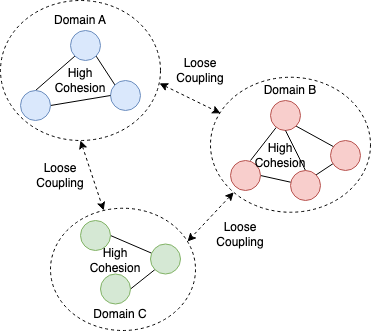
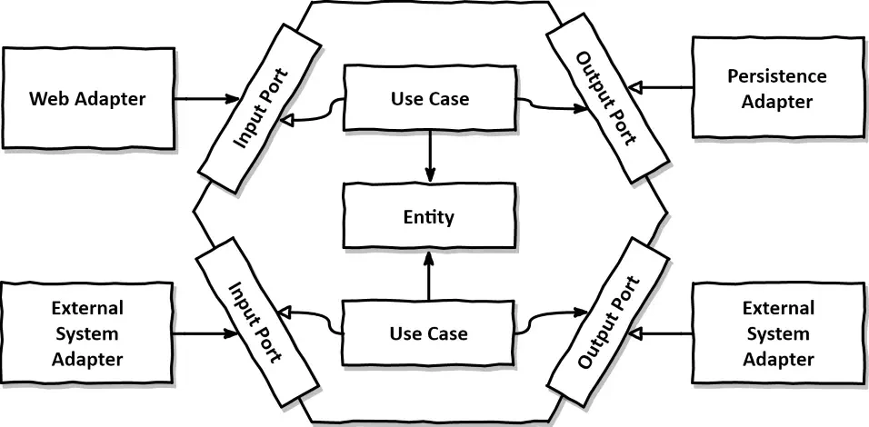
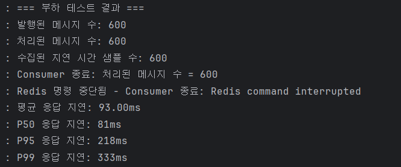
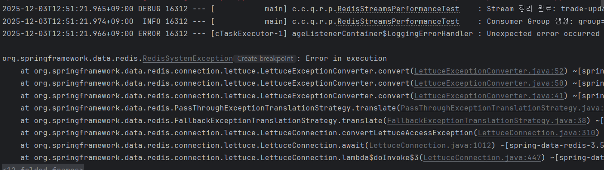
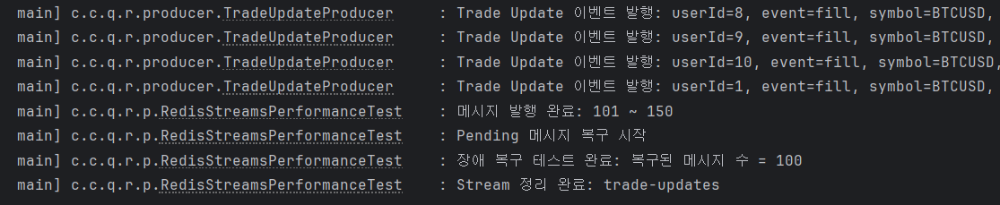

> 이 글은 졸업 프로젝트로 진행한 큐빗(QBIT) 프로젝트에서 모의투자 주문 체결 이벤트 처리 시스템을 구축하며 겪은 경험을 공유한다.


# 0. 들어가며

투자에도 공부가 필요하다는 것을 모르는 투자자는 없을 것이다. 그러나 투자 공부를 어디서부터 시작해야할지 막막하고, 손이 근질거려 투자를 서둘러 해보고 싶어 하는 초보 투자자가 대부분이다.

그렇다면, 일단 매수 버튼을 눌러보자. 큐빗이 당신의 투자 패턴을 분석해 문제점을 짚어주고, 그에 맞는 투자 이론 공부로 자연스럽게 연결해 줄 것이다.

<br>
<br>

# 1. 프로젝트 아키텍처 개요

QBIT의 백엔드는 Spring Boot 기반의 멀티 모듈 아키텍처로 구성되어 있다:

```
QBIT-BE

├── qbit-api-app        # REST API 서버

├── qbit-realtime-app   # 실시간 데이터 스트리밍 서버

├── qbit-domain         # 도메인 레이어 (엔티티, 리포지토리, 도메인 서비스)

├── qbit-infra          # 인프라 레이어 (외부 API 클라이언트, WebSocket 매니저)

└── qbit-common         # 공통 모듈 (예외, 유틸리티)
```

이러한 모듈 분리는 **도메인 주도 설계(Domain-Driven Design, DDD)** 와 **헥사고날 아키텍처(Hexagonal Architecture)** 원칙에 따라 설계되었다. 큐빗은 모놀리식 아키텍처를 채택하고 있지만, DDD의 핵심 원칙인 **Bounded Context**를 패키지 단위로 분리하여 도메인 로직을 명확히 구분했다. 또한 헥사고날 아키텍처의 핵심인 **포트-어댑터 패턴**을 거래 기능에 적용하여 외부 API 의존성을 추상화했다.

큐빗에서 왜 해당 아키텍처를 선택했는 지 이야기하기에 앞서, 먼저 DDD와 헥사고날 아키텍처가 무엇인지 간단히 소개하고자 한다.

<br>

## 1-1. 도메인 주도 설계(DDD)란?

**도메인 주도 설계(Domain-Driven Design, DDD)** 는 복잡한 비즈니스 로직을 다룰 때 사용하는 설계 방법론이다. 핵심 아이디어는 다음과 같다:

-   **도메인 중심**: 비즈니스 도메인의 언어와 개념을 코드에 직접 반영한다. 예를 들어, 큐빗에서는 "주문(Order)", "포지션(Position)", "거래 사이클(Trade Cycle)" 같은 도메인 용어를 엔티티와 서비스 이름으로 사용한다.

-   **유비쿼터스 언어**: 개발자, 기획자, 도메인 전문가가 모두 같은 용어를 사용하여 소통한다. 이는 코드와 문서 간의 불일치를 줄이고, 의사소통 비용을 낮춘다.

-   **계층 분리**: 도메인 로직을 인프라, 프레젠테이션 레이어와 명확히 분리하여, 비즈니스 규칙이 기술적 세부사항에 묶이지 않도록 한다.




이는 몇 년 전 크게 주목받았던 MSA의 개념과도 유사해보인다. 독립적인 서비스를 연결하는 구조인 MSA의 기반에는 DDD라는 설계 사상이 자리하고 있다. DDD는 Loose Coupling(느슨한 결합)과 High Cohesion(높은 응집)이라는 핵심 원칙을 통해 서비스 간 경계를 명확히 하고, 구조적 분리를 가능하게 한다. 이러한 원칙은 MSA 설계 시 반드시 고려해야 할 중요한 기준이지만, DDD를 적용한다고 해서 MSA의 완성도가 자동으로 보장되는 것은 아니다.

### Bounded Context

Bounded Context는 복잡한 도메인을 관리 가능한 단위로 나누는 DDD의 핵심 개념이다. 각 Bounded Context는 특정 도메인 모델을 정의하며, 그 컨텍스트 내에서만 유효하다. 서로 다른 Bounded Context 간의 도메인 모델은 충돌하지 않으며, 각각 독립적으로 유지된다.

> 큐빗은 모의 투자 기능을 제공하는 서비스로서, 기능 단위와 비즈니스 흐름에 따라 도메인을 구분했다. 이를 "주문 관리(Order)", "거래 사이클(Trade Cycle)", "포트폴리오(Portfolio)", "거래 기록(Journal)" 등으로 나눴다. 각 Bounded Context는 qbit-domain 모듈 내에서 패키지 단위로 분리되어 있으며, 각 패키지는 해당 도메인의 엔티티, 리포지토리, 서비스를 포함한다.

<br>

## 1-2. 헥사고날 아키텍처(Hexagonal Architecture)란?



**헥사고날 아키텍처**, 또는 **포트-어댑터 패턴(Ports and Adapters Pattern)** 은 2005년 Alistair Cockburn이 제안한 아키텍처 패턴이다. 이름의 "헥사고날(육각형)"은 도메인을 중심으로 여러 방향으로 어댑터를 연결할 수 있다는 의미에서 비롯되었다.

큐빗에서 적용한 구조는 다음과 같다:

```
   ┌─────────────────────────────────────┐
   │         Application Core            │
   │  ┌──────────────────────────────┐   │
   │  │        Domain Layer          │   │
   │  │  (Entities, Business Logic)  │   │
   │  │  OrderRequest, Portfolio,    │   │
   │  │  TradeCycle, User...         │   │
   │  └──────────────────────────────┘   │
   │  ┌──────────────────────────────┐   │
   │  │      Port (Interface)        │   │
   │  │      TradingPort             │   │
   │  │  (createOrder, cancelOrder,  │   │
   │  │   getPositions, ...)         │   │
   │  └──────────────────────────────┘   │
   └─────────────────────────────────────┘
          ↕           ↕            ↕
    ┌──────────┐ ┌──────────┐ ┌──────────┐
    │ Adapter  │ │ Adapter  │ │ Adapter  │
    │ (Alpaca) │ │(Binance) │ │(Massive) │
    │          │ │          │ │          │
    │Alpaca    │ │Binance   │ │Massive   │
    │Order     │ │WebSocket │ │WebSocket │
    │Request   │ │Manager   │ │Manager   │
    │Service   │ │          │ │          │
    └──────────┘ └──────────┘ └──────────┘
```

-   **도메인 코어(Domain Core)**: 비즈니스 로직이 있는 중심부로, 외부 의존성이 없어야 한다.

-   **포트(Port)**: 도메인이 외부와 소통하기 위한 인터페이스를 정의한다.

-   **어댑터(Adapter)**: 포트에서 정의한 인터페이스를 구현하는 외부 영역과의 연결을 담당한다.

> 현재 큐빗은 도메인의 복잡도와 책임에 따라 포트 도입 여부를 결정한 하이브리드 방식이다. 복잡도가 높은 거래 영역에 대해서만 TradingPort를 통해 추상화했으며, 해외 지수 조회 등 단순한 조회 기능은 포트 없이 직접 접근한다.

헥사고날 구조의 핵심은 **의존성 방향**이다. 도메인은 외부에 의존하지 않고, 어댑터가 도메인의 포트에 의존한다.

그렇기에 헥사고날 아키텍처는 다음과 같은 장점을 갖는다:

1.  **테스트 용이성**: 실제 외부 API 없이도 포트를 모킹하여 도메인 로직을 테스트할 수 있다.

2.  **유연성**: 새로운 외부 시스템을 추가하거나 기존 시스템을 교체할 때, 도메인 코드는 변경하지 않고 어댑터만 추가/수정하면 된다.

3.  **명확한 책임 분리**: 도메인은 "무엇을", 어댑터는 "어떻게"에 집중한다.

<br>

## 1-3. 왜 큐빗에서 DDD와 Port-Adapter 패턴을 채택했는가

**큐빗은 '초보 투자자를 위한 모의투자 결과 AI분석·이론 연계 학습 서비스'로서 모의투자 기능을 제공하므로 실제 금융 시장과의 연동이 필수적이다.** 이를 위해 여러 외부 시스템과 통합해야 하는데, 각 시스템은 서로 다른 목적과 특성을 가진다:

-   **Alpaca**: 모의 주식 거래를 위한 핵심 API. 사용자의 주문을 실제 시장에 모의로 체결하고, 포지션과 계정 정보를 제공한다.

-   **Binance**: 미국 주식 시장은 한국 기준 밤 11시에 개장하고 주말에는 휴장되므로, 개발 및 테스트 과정에서 실시간 데이터 검증이 제한되는 구간이 발생한다. **이를 보완하기 위해 24시간 거래되는 암호화폐 시장을 개발 기간동안 적극적으로 활용**하였으며, Binance의 WebSocket 스트리밍을 통해 초단위로 변동하는 시세와 호가 데이터를 수신했다.

-   **Massive.io (구 Polygon.io)**: 주식 시장의 실시간 체결 데이터 및 호가 정보를 제공하며, 유료 구독($29/month)을 통해 시장 데이터를 수신했다.

**이러한 외부 시스템들은 각각 다른 인증 방식, API 스펙, 데이터 형식을 가지고 있으며, 큐빗의 서비스 요구사항에 따라 언제든지 교체되거나 추가될 수 있다.** 예를 들어, 향후 다른 거래소 API를 추가하거나, 비용 문제로 데이터 제공자를 변경해야 할 수도 있다.

필자는 [실제로 Alpaca 사용 과정에서 코인 paper trading 기능에 문제가 발생한 경험](https://forum.alpaca.markets/t/paper-crypto-trades-broken/18126/7)이 있었으며, 이를 통해 특정 서비스 의존을 줄이고 교체가 가능한 유연한 구조의 필요성을 체감했다.

<br>
<br>

# 2. 모의투자 주문 체결 이벤트 처리 시스템의 구현 및 개선

앞서 큐빗의 아키텍처 설계 철학을 설명한 것은, 이 글의 핵심 주제인 **모의투자 주문 체결 이벤트 처리 시스템의 구현 및 개선 과정**을 설명하기 위한 기반이었다.

**큐빗의 핵심 기능인 모의투자 서비스에서는 사용자 주문 체결 이벤트를 실시간으로 처리하는 것이 중요하다.** 사용자가 주문을 제출하면 Alpaca API를 통해 실제 시장에 모의로 체결되며, 체결 상태 변경(주문 접수, 부분 체결, 완전 체결 등)을 실시간으로 사용자에게 전달해야 한다. 또한 이러한 이벤트를 데이터베이스에 동기화하여 주문 내역, 포트폴리오, 거래 기록 등을 관리해야 한다.

<br>

## 2-1. 초기 아키텍처: Redis Pub/Sub

프로젝트 초기에는 Redis Pub/Sub을 사용하여 주문 체결 이벤트를 처리했는데, 그 이유는 다음과 같다:

1.  **구현의 단순함**: Redis는 이미 세션 관리 용도로 사용 중이었기때문에 별도의 인프라를 추가할 필요가 없었다.

2.  **빠른 프로토타이핑**: Pub/Sub은 publish와 subscribe 구조가 직관적이어서, 이벤트 발생 → 전파 → 클라이언트 전달 흐름을 짧은 시간 안에 구현할 수 있었다.

<br>

## 2-2. Redis Pub/Sub의 한계와 Streams의 전환

처음엔 Pub/Sub 구조를 고려했지만, **Sub 장애 시 데이터 손실이 발생**해 실시간 처리에는 부적합하다는 결론에 이르렀다. Redis Pub/Sub은 메시지를 메모리에만 저장하고, 구독자가 연결되어 있지 않으면 메시지가 손실되는 구조이기 때문이다.

이 문제를 방지하기 위해 **Redis Streams 기반 구조를 도입**해 데이터를 순차적으로 기록하고, 장애 발생 시 마지막 처리 지점부터 복구할 수 있도록 설계했다. Redis Streams는 메시지를 영구 저장하고, Consumer Group을 통해 여러 워커가 안전하게 메시지를 처리할 수 있으며, ACK(확인 응답) 기반으로 처리 상태를 추적할 수 있다.

이러한 마이그레이션 과정에서 앞서 설명한 **DDD와 헥사고날 아키텍처의 원칙이 큰 도움이 되었다**. 특히 **도메인 레이어(`qbit-domain/`)와 애플리케이션 레이어(`qbit-api-app`, `qbit-realtime-app`)의 명확한 분리** 덕분에 마이그레이션의 영향 범위를 애플리케이션 레이어의 이벤트 처리 부분으로 한정할 수 있었다.

<br>

## 아키텍처 분리의 효과: 도메인 로직과 인프라의 독립성

예를 들어, 주문 처리의 핵심 도메인 로직은 `qbit-domain/order/` 패키지에 위치한 `OrderRequest` 엔티티와 주문 상태 전이 규칙 등으로 구성되어 있다. `OrderRequest` 엔티티는 다음과 같은 도메인 메서드를 제공한다:

```196:215:qbit-domain/src/main/java/com/curihous/qbit/domain/order/entity/OrderRequest.java
    // 주문 상태 업데이트 
    public void updateStatus(OrderStatus newStatus) {
        this.status = newStatus;
    }
    
    // 체결 정보 업데이트 (부분 체결, 완전 체결)
    public void updateFilledInfo(BigDecimal filledQty, BigDecimal filledAvgPrice, OffsetDateTime filledAt) {
        this.filledQuantity = filledQty;
        this.filledAvgPrice = filledAvgPrice;
        
        if (filledAt != null) {
            this.filledAt = filledAt;
        }
        
        // 체결 상태에 따라 상태 자동 업데이트
        if (filledQty.compareTo(this.quantity) >= 0) {
            this.status = OrderStatus.FILLED;
        } else if (filledQty.compareTo(BigDecimal.ZERO) > 0) {
            this.status = OrderStatus.PARTIALLY_FILLED;
        }
    }
```

이러한 도메인 로직은 **이벤트 처리 인프라와 완전히 분리**되어 있어, Redis Pub/Sub에서 Redis Streams로 전환하는 과정에서 **도메인 레이어의 코드는 한 줄도 변경하지 않았다**. 

반면 이벤트 처리 인프라는 애플리케이션 레이어에서만 변경되었다.

**시스템은 Producer와 Consumer로 구성된다.** Producer는 Alpaca WebSocket에서 수신한 Trade Update 이벤트를 Redis Streams에 발행한다. Consumer는 2개의 독립적인 그룹이 존재하는데, `qbit-api-group`은 주문 상태를 데이터베이스에 동기화하고, `qbit-realtime-group`은 클라이언트로 WebSocket 브로드캐스트를 수행한다. 메시지 처리 후 ACK를 통해 상태를 추적함으로써, 마이그레이션 이전 Pub/Sub 사용 시 발생했던 장애 상황의 메시지 누락 문제를 해결했다.

### 1. **Producer (`qbit-realtime-app/producer/TradeUpdateProducer`)**: Alpaca WebSocket에서 수신한 Trade Update 이벤트를 Redis Streams에 발행

```26:39:qbit-realtime-app/src/main/java/com/curihous/qbit/realtime/producer/TradeUpdateProducer.java
    // Trade Update 이벤트 발행
    public void publishTradeUpdate(TradeUpdateEvent event) {
        try {
            Map<String, Object> map = Map.of("value", event);
            redisTemplate.opsForStream()
                    .add(MapRecord.create(STREAM_KEY, map));
            
            log.info("Trade Update 이벤트 발행: userId={}, event={}, symbol={}, orderId={}", 
                    event.getUserId(), event.getEvent(), event.getSymbol(), event.getAlpacaOrderId());
            
        } catch (Exception e) {
            log.error("Trade Update 이벤트 발행 실패: event={}, error={}", 
                    event.getEvent(), e.getMessage(), e);
        }
    }
```

### 2. **Consumer (`qbit-api-app/consumer/TradeUpdateConsumer`)**: Streams에서 메시지를 수신하여 도메인 서비스를 호출하여 주문 상태를 데이터베이스에 동기화

```20:38:qbit-api-app/src/main/java/com/curihous/qbit/api/consumer/TradeUpdateConsumer.java
    public void onMessage(TradeUpdateEvent event) {
        try {
            log.info("Trade Update Consumer 처리 시작: userId={}, event={}, symbol={}, orderId={}",
                    event.getUserId(), event.getEvent(), event.getSymbol(), event.getAlpacaOrderId());
            
            // 이벤트 처리
            alpacaOrderSyncService.processTradeUpdate(event);
            
            log.debug("Trade Update Consumer 처리 완료: userId={}, event={}", 
                    event.getUserId(), event.getEvent());
            
        } catch (Exception e) {
            log.error("Trade Update 처리 중 오류: userId={}, event={}, error={}", 
                    event != null ? event.getUserId() : "unknown",
                    event != null ? event.getEvent() : "unknown", 
                    e.getMessage(), e);
            throw e; // 상위에서 Ack 처리를 위해
        }
    }
```

### 3. **Consumer (`qbit-realtime-app/consumer/OrderUpdateConsumer`)**: Streams에서 메시지를 수신하여 WebSocket으로 클라이언트에게 브로드캐스트

이러한 구조 덕분에 **인프라 변경이 도메인 로직에 영향을 주지 않았고**, 마이그레이션 과정에서 도메인의 무결성을 보장할 수 있었다.

### Redis Streams 구현 상세: Consumer Group과 ACK 기반 처리

Redis Streams의 핵심 기능인 **Consumer Group**을 활용하여 여러 워커가 안전하게 메시지를 처리할 수 있도록 구현했다. `qbit-api-app`과 `qbit-realtime-app`은 각각 독립적인 Consumer Group을 사용하여 동일한 Stream에서 서로 다른 목적으로 메시지를 소비한다:

```30:35:qbit-api-app/src/main/java/com/curihous/qbit/api/config/RedisStreamsConfig.java
    // Stream 키
    private static final String TRADE_UPDATE_STREAM = "trade-updates";
    
    // Consumer 그룹 및 이름
    private static final String CONSUMER_GROUP = "qbit-api-group";
    private static final String CONSUMER_TRADE = "qbit-api-consumer-trade";
```

```31:38:qbit-realtime-app/src/main/java/com/curihous/qbit/realtime/config/RedisStreamsConfig.java
    // Stream 키
    private static final String TRADE_UPDATE_STREAM = "trade-updates";
    private static final String LOGIN_SYNC_STREAM = "login-order-sync";
    
    // Consumer 그룹 및 이름
    private static final String CONSUMER_GROUP = "qbit-realtime-group";
    private static final String CONSUMER_TRADE = "qbit-realtime-consumer-trade";
    private static final String CONSUMER_LOGIN = "qbit-realtime-consumer-login";
```

각 Consumer는 `ReadOffset.from(">")`를 사용하여 **처리되지 않은 새 메시지만 읽도록** 설정했으며, 메시지 처리 완료 후 **ACK(확인 응답)**를 통해 처리 상태를 추적한다:

```62:88:qbit-api-app/src/main/java/com/curihous/qbit/api/config/RedisStreamsConfig.java
        container.receive(
                Consumer.from(CONSUMER_GROUP, CONSUMER_TRADE),
                StreamOffset.create(TRADE_UPDATE_STREAM, ReadOffset.from(">")), // 처리되지 않은 새 메시지만 읽기
                message -> {
                    try {
                        log.info("Trade Update 메시지 수신: messageId={}, stream={}", 
                                message.getId(), message.getStream());
                        
                        // MapRecord에서 value 필드 추출
                        Map<Object, Object> valueMap = message.getValue();
                        Object valueObj = valueMap.get("value");
                        
                        if (valueObj == null) {
                            log.warn("Trade Update 메시지에 value 필드가 없습니다: messageId={}", message.getId());
                            ackMessage(message.getId());
                            return;
                        }
                        
                        // value가 String인 경우 역직렬화, TradeUpdateEvent인 경우 그대로 사용
                        if (valueObj instanceof TradeUpdateEvent event) {
                            log.info("Trade Update 이벤트 수신: userId={}, event={}, symbol={}, orderId={}",
                                    event.getUserId(), event.getEvent(), event.getSymbol(), event.getAlpacaOrderId());
                            tradeUpdateConsumer.onMessage(event);
                            ackMessage(message.getId());
                            log.debug("Trade Update 메시지 처리 완료 및 Ack: messageId={}", message.getId());
                            return;
                        }
```

ACK 처리는 다음과 같이 구현되었다:

```188:198:qbit-api-app/src/main/java/com/curihous/qbit/api/config/RedisStreamsConfig.java
    // 메시지 Ack 처리
    private void ackMessage(org.springframework.data.redis.connection.stream.RecordId messageId) {
        try {
            connectionFactory.getConnection().streamCommands()
                    .xAck(TRADE_UPDATE_STREAM.getBytes(), CONSUMER_GROUP, messageId.getValue());
            log.debug("Trade Update 메시지 Ack 처리: messageId={}", messageId);
        } catch (Exception e) {
            log.error("Trade Update 메시지 Ack 처리 실패: messageId={}, error={}", 
                    messageId, e.getMessage(), e);
        }
    }
```

이러한 ACK 기반 처리 덕분에 **워커가 장애로 중단되어도, 재시작 시 마지막 ACK 이후의 메시지부터 자동으로 재처리**되어 데이터 손실을 방지할 수 있다.

<br>

## 3. 성능 테스트

테스트 단계에서는 트래픽이 급증하는 장 마감 구간을 가정해 초당 수백 건의 주문을 Streams에 주입하며 부하를 시뮬레이션했다. 성능 테스트는 `qbit-realtime-app/src/test/java/com/curihous/qbit/realtime/performance/RedisStreamsPerformanceTest.java`에 구현되어 있으며, 다음과 같은 시나리오를 검증했다:

### 고부하 처리 능력 검증 (testHighLoadThroughput)

**테스트 목적**: 초당 수백 건의 메시지 처리 시 시스템의 처리율과 응답 지연 시간을 검증

**테스트 설계**:
- **발행 단계**: 3초 동안 초당 200개씩 총 600개 메시지 발행
- **처리 단계**: Producer와 Consumer를 병렬로 실행하여 실시간 처리 시뮬레이션
  - Producer: 1초 간격으로 배치 발행 (초당 200개)
  - Consumer: 100ms 간격으로 메시지 읽기 및 처리
- **대기 단계**: 발행 완료 후 최대 10초 동안 남은 메시지 처리 대기
  - 1초 동안 처리 진행이 없으면 종료
- **검증 기준**: 
  - 처리율: 발행된 메시지의 95% 이상 처리
  - 평균 지연: 200ms 이하
  - P95 지연: 300ms 이하
  
**목표치 설정 근거**:
거래 시스템의 지연 시간 목표는 자산 유형과 거래 전략에 따라 다르다. [LuxAlgo의 거래 시스템 지연 시간 기준 연구](https://www.luxalgo.com/blog/latency-standards-in-trading-systems/)에 따르면:

- **고빈도 주식 거래(High-Frequency Equities)**: 100ms 미만 요구
- **일반 주식 거래(Retail Stocks)**: 100-300ms 범위 적절
- **Forex 거래**: 100-300ms 범위에서 대부분의 알고리즘 거래 전략에 효과적
- **일반 알고리즘 거래 전략**: 100-300ms 범위에서 효과적으로 동작

모의투자 시스템은 일반 주식 거래(Retail Stocks) 및 알고리즘 거래 전략에 해당하므로, 100-300ms 범위 내에서 평균 200ms, P95 300ms를 목표로 설정했다. 

**지연 시간 측정 방식**:
- Producer: 메시지 발행 시 sequence 번호(`"seq-" + sequence`)와 발행 시간을 `ConcurrentHashMap`에 저장
- Consumer: 메시지의 `orderId`에서 sequence 추출 → `publishTimes`에서 발행 시간 조회 → 현재 시간과의 차이로 지연 시간 계산

초당 200건의 메시지를 3초간 지속적으로 발행하며 시스템의 처리 능력을 테스트했다:

```77:141:qbit-realtime-app/src/test/java/com/curihous/qbit/realtime/performance/RedisStreamsPerformanceTest.java
    @Test
    @DisplayName("초당 수백 건의 주문 부하 시뮬레이션 - 평균 응답 지연 확인")
    void testHighLoadThroughput() {
        // given: 테스트 데이터 구조 초기화
        Map<String, Long> publishTimes = new ConcurrentHashMap<>();  // sequence -> 발행 시간
        List<Long> latencies = new CopyOnWriteArrayList<>();          // 지연 시간 목록
        AtomicInteger publishedCount = new AtomicInteger(0);
        AtomicInteger processedCount = new AtomicInteger(0);
        AtomicBoolean publishingComplete = new AtomicBoolean(false);

        // when: Producer와 Consumer를 병렬로 실행
        Future<?> producerFuture = startProducer(publishTimes, publishedCount, publishingComplete);
        Future<?> consumerFuture = startConsumer(publishTimes, latencies, processedCount, publishingComplete);

        // then: 발행 완료 대기
        try {
            producerFuture.get(PUBLISH_DURATION_SECONDS + 5, TimeUnit.SECONDS);
            log.info("발행 완료: 발행된 메시지 수 = {}", publishedCount.get());
        } catch (Exception e) {
            log.warn("Producer 대기 중 오류: {}", e.getMessage());
        }

        // 발행 완료 후 처리 대기
        publishingComplete.set(true);
        log.info("발행 완료 후 처리 대기 시작: 처리된 메시지 수 = {}", processedCount.get());
        
        // 일정 시간 동안 처리된 메시지가 없을 때까지 대기
        // (1초 동안 진행 없으면 종료)
        int previousProcessed = processedCount.get();
        int noProgressCount = 0;
        long startWaitTime = System.currentTimeMillis();
        long maxWaitTime = PROCESSING_TIMEOUT_SECONDS * 1000L;
        
        while ((System.currentTimeMillis() - startWaitTime) < maxWaitTime) {
            try {
                Thread.sleep(200);
                int currentProcessed = processedCount.get();
                
                if (currentProcessed > previousProcessed) {
                    // 진행 중 - 카운터 리셋
                    previousProcessed = currentProcessed;
                    noProgressCount = 0;
                } else {
                    // 진행 없음 - 카운터 증가
                    noProgressCount++;
                    if (noProgressCount >= 5) {  // 200ms * 5 = 1초 동안 진행 없으면 종료
                        log.info("처리 진행 없음으로 종료: 처리된 메시지 수 = {}", currentProcessed);
                        break;
                    }
                }
            } catch (InterruptedException e) {
                Thread.currentThread().interrupt();
                break;
            }
        }
        
        log.info("처리 대기 완료: 발행된 메시지 수 = {}, 처리된 메시지 수 = {}", 
            publishedCount.get(), processedCount.get());

        // 종료
        consumerFuture.cancel(true);

        // 검증: 처리율 및 지연 시간 검증
        assertPerformanceMetrics(latencies, processedCount, publishedCount);
    }
```

```167:275:qbit-realtime-app/src/test/java/com/curihous/qbit/realtime/performance/RedisStreamsPerformanceTest.java
    private Future<?> startProducer(Map<String, Long> publishTimes, AtomicInteger publishedCount, 
                                   AtomicBoolean publishingComplete) {
        return executorService.submit(() -> {
            ScheduledExecutorService scheduler = Executors.newScheduledThreadPool(1);
            try {
                scheduler.scheduleAtFixedRate(() -> {
                    int remaining = EXPECTED_TOTAL_MESSAGES - publishedCount.get();
                    if (remaining <= 0) {
                        return;
                    }
                    
                    int batchSize = Math.min(MESSAGES_PER_SECOND, remaining);
                    
                    IntStream.range(0, batchSize)
                        .forEach(i -> {
                            if (publishedCount.get() >= EXPECTED_TOTAL_MESSAGES) {
                                return;
                            }
                            
                            int sequence = publishedCount.incrementAndGet();
                            TradeUpdateEvent event = createTestEvent(sequence);
                            long publishTime = System.currentTimeMillis();
                            
                            try {
                                // TradeUpdateProducer를 사용하여 실제 프로덕션과 동일한 방식으로 발행
                                tradeUpdateProducer.publishTradeUpdate(event);
                                
                                // 발행 시간 기록 (sequence 번호를 키로 사용)
                                // Consumer에서 orderId에서 sequence를 추출하여 지연 시간 측정
                                publishTimes.put("seq-" + sequence, publishTime);
                            } catch (Exception e) {
                                log.error("메시지 발행 실패: sequence={}, error={}", sequence, e.getMessage());
                            }
                        });
                }, 0, 1, TimeUnit.SECONDS);
                
                // 발행 시간 동안 실행
                Thread.sleep(PUBLISH_DURATION_SECONDS * 1000L);
            } catch (InterruptedException e) {
                Thread.currentThread().interrupt();
            } finally {
                shutdownExecutor(scheduler);
            }
        });
    }

    private Future<?> startConsumer(Map<String, Long> publishTimes, List<Long> latencies,
                                    AtomicInteger processedCount, AtomicBoolean publishingComplete) {
        return executorService.submit(() -> {
            ScheduledExecutorService scheduler = Executors.newScheduledThreadPool(1);
            AtomicInteger consecutiveErrors = new AtomicInteger(0);
            final int MAX_CONSECUTIVE_ERRORS = 10;
            
            try {
                AtomicBoolean shouldStop = new AtomicBoolean(false);
                
                scheduler.scheduleAtFixedRate(() -> {
                    if (shouldStop.get()) {
                        return;
                    }
                    
                    try {
                        processMessages(publishTimes, latencies, processedCount);
                        consecutiveErrors.set(0); // 성공 시 에러 카운터 리셋
                    } catch (Exception e) {
                        String errorMsg = e.getMessage();
                        
                        // Redis command interrupted는 테스트 종료 시그널로 처리
                        if (errorMsg != null && 
                            (errorMsg.contains("Redis command interrupted") || 
                             errorMsg.contains("Command interrupted") ||
                             e instanceof java.util.concurrent.CancellationException)) {
                            log.debug("Redis 명령 중단됨 - Consumer 종료: {}", errorMsg);
                            shouldStop.set(true);
                            return;
                        }
                        
                        int errorCount = consecutiveErrors.incrementAndGet();
                        
                        if (errorCount <= MAX_CONSECUTIVE_ERRORS) {
                            log.warn("메시지 수신 실패 (재시도 중): error={}, count={}", errorMsg, errorCount);
                        } else {
                            log.error("메시지 수신 실패 (최대 재시도 횟수 초과): error={}, count={}", errorMsg, errorCount);
                            // 연속 에러가 너무 많으면 Consumer 종료
                            shouldStop.set(true);
                        }
                    }
                }, 0, 100, TimeUnit.MILLISECONDS);
                
                // 메인 테스트에서 종료 조건을 관리하므로 여기서는 무한 대기
                // cancel() 호출 시 shouldStop이 true가 되어 자동 종료됨
                while (!shouldStop.get()) {
                    try {
                        Thread.sleep(1000);
                    } catch (InterruptedException e) {
                        Thread.currentThread().interrupt();
                        break;
                    }
                }
                
                log.info("Consumer 종료: 처리된 메시지 수 = {}", processedCount.get());
            } finally {
                shutdownExecutor(scheduler);
            }
        });
    }
```

**테스트 구현 상세**:

테스트는 발행 시간과 처리 시간을 분리하여 설계했다. Producer는 3초 동안 메시지를 발행하고 종료되며, Consumer는 발행 완료 후에도 최대 10초 동안 남은 메시지를 처리한다. 1초 동안 처리 진행이 없으면 종료하여 불필요한 대기를 방지한다.

**실제 테스트 실행 결과**:

초당 200건의 메시지를 3초간 지속적으로 발행한 결과:



```
2025-12-03T12:51:27.909+09:00  INFO 16312 --- [           main] c.c.q.r.p.RedisStreamsPerformanceTest    : === 부하 테스트 결과 ===
2025-12-03T12:51:27.909+09:00  INFO 16312 --- [           main] c.c.q.r.p.RedisStreamsPerformanceTest    : 발행된 메시지 수: 600
2025-12-03T12:51:27.909+09:00  INFO 16312 --- [           main] c.c.q.r.p.RedisStreamsPerformanceTest    : 처리된 메시지 수: 600
2025-12-03T12:51:27.909+09:00  INFO 16312 --- [           main] c.c.q.r.p.RedisStreamsPerformanceTest    : 수집된 지연 시간 샘플 수: 600
2025-12-03T12:51:27.914+09:00  INFO 16312 --- [           main] c.c.q.r.p.RedisStreamsPerformanceTest    : 평균 응답 지연: 93.00ms
2025-12-03T12:51:27.914+09:00  INFO 16312 --- [           main] c.c.q.r.p.RedisStreamsPerformanceTest    : P50 응답 지연: 81ms
2025-12-03T12:51:27.914+09:00  INFO 16312 --- [           main] c.c.q.r.p.RedisStreamsPerformanceTest    : P95 응답 지연: 218ms
2025-12-03T12:51:27.914+09:00  INFO 16312 --- [           main] c.c.q.r.p.RedisStreamsPerformanceTest    : P99 응답 지연: 333ms
```

**테스트 결과 분석**:

-   **발행된 메시지 수**: 600건 (초당 200건 × 3초)
-   **처리된 메시지 수**: 600건 (처리율 100%)
-   **평균 응답 지연**: 93.00ms (목표 200ms 이하, **53% 여유**)
-   **P50 응답 지연**: 81ms
-   **P95 응답 지연**: 218ms (목표 300ms 이하, **27% 여유**)
-   **P99 응답 지연**: 333ms

**성능 평가**: 초당 200건의 메시지를 3초 동안 지속 발행한 결과, 처리율 100%, 평균 응답 지연 93ms로 목표를 상회하는 성능을 확보해 실시간 거래 시스템으로서의 안정성을 검증했다.

발행 시간과 처리 시간을 분리한 설계 덕분에 발행 완료 후에도 남은 메시지를 충분히 처리할 수 있었고, **모든 메시지가 성공적으로 처리**되었다. 실제 운영 환경에서는 **Consumer가 지속적으로 실행**되므로, 모든 메시지가 최종적으로 처리된다. Redis Streams의 ACK 기반 처리 메커니즘 덕분에 **워커 재시작 시 미처리 메시지도 자동으로 재처리**되어 데이터 손실이 발생하지 않는다.

### 장애 복구 검증 (testFailureRecovery)

**테스트 목적**: Consumer가 장애로 중단된 후 재시작 시 데이터 손실 없이 복구되는지 검증

**테스트 설계**:
1. **초기 발행**: 100개 메시지 발행
2. **부분 처리**: 50개만 처리 (나머지 50개는 Pending 상태로 남음)
3. **Consumer 중단**: 워커 중단 시뮬레이션 (500ms 대기 후 종료)
4. **추가 발행**: 중단 중 50개 추가 발행
5. **복구**: 재시작 후 Pending 메시지 + 새 메시지 모두 복구 확인

**복구 방식**:
- **Pending 메시지**: `ReadOffset.from("0-0")`로 읽어서 ACK되지 않은 메시지 복구
- **새 메시지**: `ReadOffset.from(">")`로 읽어서 새로 발행된 메시지 처리
- 중복 방지: `ConcurrentHashMap.newKeySet()`으로 처리된 메시지 ID 추적

워커를 중단시켜 장애를 유도하고, 재시작 시 데이터 손실 없이 복구되는지 검증했다:



```143:163:qbit-realtime-app/src/test/java/com/curihous/qbit/realtime/performance/RedisStreamsPerformanceTest.java
    @Test
    @DisplayName("장애 복구 테스트 - 워커 중단 후 재시작 시 데이터 손실 없이 복구 확인")
    void testFailureRecovery() throws InterruptedException {
        // given: 초기 메시지 발행
        int initialMessages = 100;
        int additionalMessages = 50;
        
        publishMessages(1, initialMessages);
        
        // when: Consumer가 일부 처리한 후 중단 시뮬레이션
        processMessagesPartially(initialMessages / 2);  // 50개만 처리
        
        // 추가 메시지 발행 (워커 중단 중)
        publishMessages(initialMessages + 1, initialMessages + additionalMessages);
        
        // then: 재시작 후 모든 메시지 복구 확인
        int recoveredCount = recoverAllMessages();
        
        assertThat(recoveredCount).isGreaterThanOrEqualTo(additionalMessages);
        log.info("장애 복구 테스트 완료: 복구된 메시지 수 = {}", recoveredCount);
    }
```

테스트 결과:

-   **데이터 손실 없이 복구**: 워커를 중단시켜 장애를 유도했을 때도 ACK 이후 오프셋부터 재처리가 이어지며 **데이터 손실 없이 복구**됨
-   **Pending 메시지 처리**: Redis Streams의 Pending 메시지 기능을 활용하여 ACK되지 않은 메시지를 자동으로 재처리

**실제 테스트 실행 결과**:



```
2025-12-03T12:51:23.829+09:00  INFO 16312 --- [           main] c.c.q.r.p.RedisStreamsPerformanceTest    : 장애 복구 테스트 완료: 복구된 메시지 수 = 100
```

테스트 결과:

-   **데이터 손실 없이 복구**: 워커를 중단시켜 장애를 유도했을 때도 ACK 이후 오프셋부터 재처리가 이어지며 **데이터 손실 없이 복구**됨
-   **Pending 메시지 처리**: Redis Streams의 Pending 메시지 기능을 활용하여 ACK되지 않은 메시지를 자동으로 재처리
-   **복구된 메시지 수**: 100개 (초기 발행 100개 중 미처리 50개 + 추가 발행 50개 모두 복구)

이러한 성능 테스트를 통해 실시간 데이터 처리 시스템이 실제 운영 환경에서 요구되는 성능과 안정성을 만족함을 확인했다.

